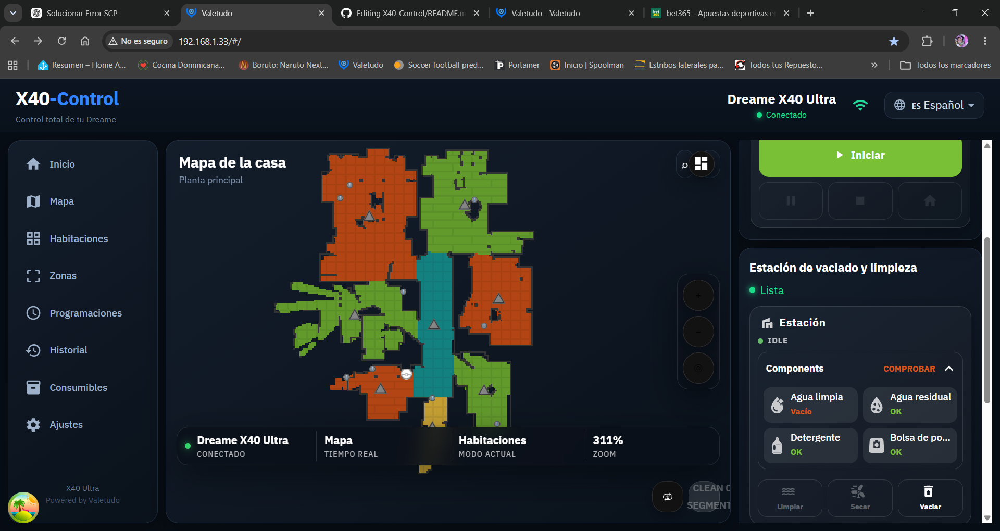

# X40-Control 🇪🇸

Interfaz personalizada de Valetudo para el **Dreame X40 Ultra**, con una interfaz moderna y traducida al español.



## ✨ Características

- 🇪🇸 Interfaz completamente en español
- 🤖 Control del Dreame X40 Ultra
- 🗺️ Mapas
- 🏠 Habitaciones y zonas
- 🧹 Aspirado y fregado
- 🎮 Control manual
- 📅 Programaciones
- 📊 Estadísticas
- 🔧 Gestión de consumibles
- 📡 Conectividad
- 📋 Diagnóstico
- 💾 Copias de seguridad
- 📦 Instalador automático

## 🤖 Compatibilidad

Actualmente desarrollado y probado para:

- **Dreame X40 Ultra**
- Arquitectura **ARM64 / aarch64**
- Valetudo **2026.05.0**

## 🚀 Instalación

X40-Control puede instalarse desde cualquier ordenador que tenga acceso SSH al robot.

**No es necesario utilizar una Raspberry Pi.**

### 1. Descargar X40-Control

Clona el repositorio:

```bash
git clone https://github.com/orlandoida06-rgb/X40-Control.git
cd X40-Control
