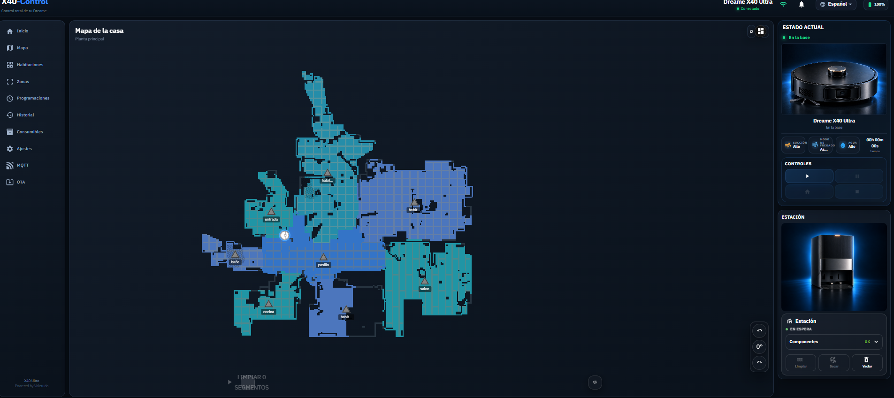
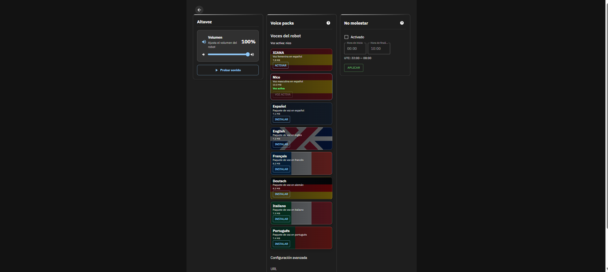
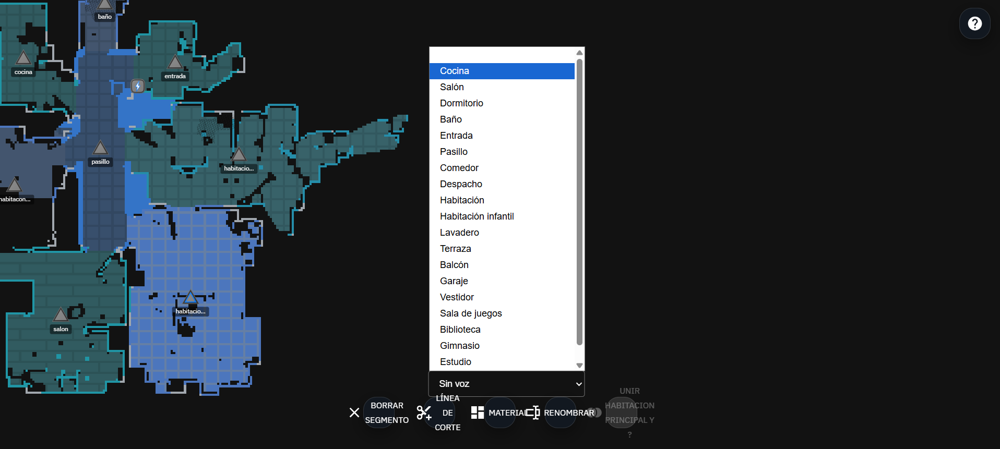
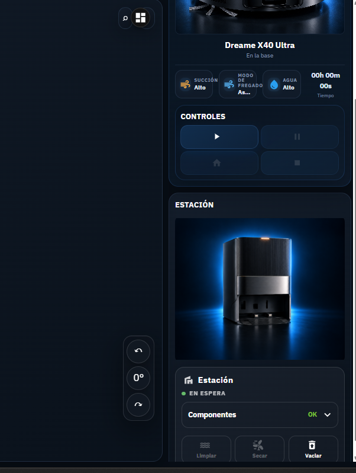
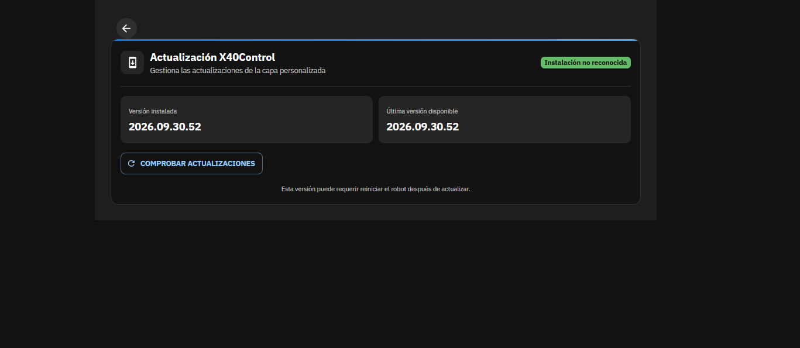
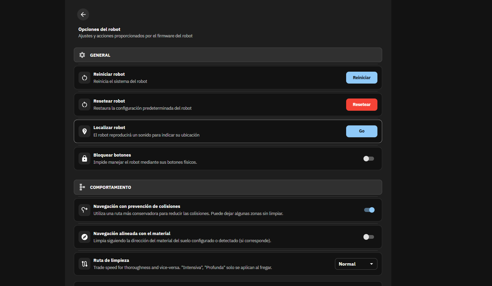

# X40-Control 🇪🇸

**Interfaz personalizada para Dreame X40 Ultra.**

X40-Control es una interfaz personalizada basada en Valetudo y orientada al **Dreame X40 Ultra**, con una experiencia moderna, traducida al español y con funciones adicionales para el control y diagnóstico del robot.

> Proyecto independiente para usuarios del Dreame X40 Ultra y Valetudo.

## ✨ Características

- 🇪🇸 Interfaz completamente en español
- 🤖 Control del Dreame X40 Ultra
- 🗺️ Mapas
- 🏠 Habitaciones y zonas
- 🧹 Aspirado y fregado
- 🎮 Control manual
- 📅 Programaciones
- 📊 Estadísticas
- 🔧 Gestión de consumibles
- 📡 Conectividad
- 📋 Diagnóstico
- 💾 Copias de seguridad
- 📦 Instalador automático

---

## 🔊 Voces personalizadas

X40-Control incorpora soporte para paquetes de voces personalizadas para el Dreame X40 Ultra.

El paquete **NICO** está disponible en español.

También se muestran otros idiomas disponibles desde la interfaz. Estos paquetes se encuentran actualmente en **fase beta**.

---

## 🏠 Habitaciones

X40-Control permite gestionar las habitaciones directamente desde el mapa.

Las habitaciones disponen de nombres personalizados y pueden asociarse a las voces correspondientes.

---

## 🔊 Voces en estados del robot

Las voces personalizadas también están disponibles en los diferentes modos y estados del robot.

---

## 📦 Actualizaciones OTA

X40-Control incorpora un sistema de actualización OTA para gestionar las actualizaciones de la capa personalizada.

Desde la interfaz se puede consultar:

- Versión instalada.
- Última versión disponible.
- Estado de la actualización.
- Información sobre la necesidad de reiniciar después de actualizar.

---

## ⚙️ Opciones del robot

X40-Control proporciona acceso a diferentes opciones y controles del Dreame X40 Ultra.

Entre ellas se encuentran:

- Reiniciar el robot.
- Resetear el robot.
- Localizar el robot.
- Bloquear los botones.
- Opciones de navegación.
- Configuración de la ruta de limpieza.

## 🤖 Compatibilidad

Actualmente desarrollado y probado para:

- **Dreame X40 Ultra**
- Arquitectura **ARM64 / aarch64**
- Valetudo **2026.05.0**

## 🚀 Instalación

X40-Control puede instalarse desde cualquier ordenador que tenga acceso SSH al robot.

Necesitas acceso SSH como **root** al robot mediante una clave SSH válida. La clave no tiene que llamarse `id_rsa`; puedes utilizar cualquier clave autorizada para acceder al robot.

### 1. Descargar X40-Control

Clona el repositorio:

    git clone https://github.com/orlandoida06-rgb/X40-Control.git
    cd X40-Control

### 2. Dar permisos de ejecución

    chmod +x install-x40control.sh

### 3. Instalar X40-Control

Ejecuta el instalador indicando:

    IP_DEL_ROBOT
    RUTA_DE_LA_CLAVE_SSH

Comando:

    ./install-x40control.sh IP_DEL_ROBOT RUTA_DE_LA_CLAVE_SSH

Ejemplo:

    ./install-x40control.sh 192.168.1.50 ~/.ssh/id_rsa

La IP y la ruta utilizadas en el ejemplo son únicamente orientativas.

Cada usuario debe utilizar la IP de su propio robot y la ruta de su propia clave SSH.

El instalador utiliza el usuario `root`.

---

## 📦 Instalación rápida

    git clone https://github.com/orlandoida06-rgb/X40-Control.git
    cd X40-Control
    chmod +x install-x40control.sh
    ./install-x40control.sh IP_DEL_ROBOT RUTA_DE_LA_CLAVE_SSH
